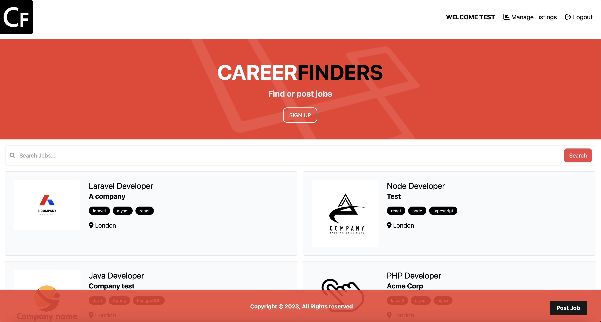

# Job Board Website

## Overview
This project is a Job Board website developed using Laravel, a robust PHP web framework, with a stack of modern technologies to provide a seamless and user-friendly job posting and job search experience. The website is designed to connect job seekers with employers by allowing them to post and search for job listings.

## Key Technologies Used
- **Laravel:** The project's foundation is built on Laravel, a highly popular PHP framework known for its elegant syntax and powerful features. Laravel provides a secure and efficient backend for handling user authentication, job posting, and job search functionalities.

- **Alpine.js:** Alpine.js is utilized for adding dynamic, client-side interactivity to the website. It enables features like live search and filtering of job listings, enhancing the user experience.

- **Tailwind CSS:** Tailwind CSS is the chosen UI framework for this project, offering a utility-first approach to styling. It ensures the website looks visually appealing and responsive on various devices.

- **Font Awesome:** Font Awesome is used to integrate icons, providing visual cues and enhancing the overall design of the website.

- **Lodash:** Lodash is a JavaScript utility library that assists in handling data manipulation and simplifying complex tasks, contributing to the efficiency and functionality of the project.

## Additional Technologies
- **Google Font API:** Google Fonts are incorporated to improve the website's typography, making content more readable and aesthetically pleasing.

- **CDN Integration (Cloudflare, cdnjs, Unpkg):** Content Delivery Networks (CDNs) are leveraged to ensure fast and reliable content delivery, optimizing website performance.

- **Clockwork:** Clockwork is used for debugging and profiling, aiding developers in diagnosing and resolving issues efficiently during development.

## Project Features
- **User Registration and Authentication:** Job seekers and employers can register and log in to manage their profiles and job listings.

- **Job Posting:** Employers can post job listings, providing detailed information about job roles, requirements, and application instructions.

- **Job Search:** Job seekers can search for jobs using various filters such as location, category, and keywords, thanks to the dynamic search functionality powered by Alpine.js.

- **Responsive Design:** Tailwind CSS ensures that the website is fully responsive, offering a seamless experience on desktop and mobile devices.

- **Performance Optimization:** CDNs, Google Fonts API, and other performance enhancements are implemented to guarantee fast loading times.

